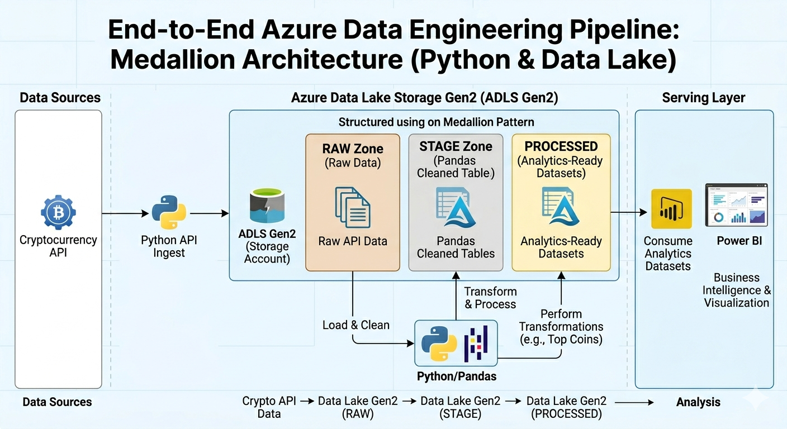

# End-to-End Azure Data Engineering Pipeline (Crypto Data)

This project is an end-to-end data engineering pipeline designed to process and analyze real-time cryptocurrency data. The goal is to ingest raw API data into Azure Cloud, process it using Python/Pandas, and create structured, analytics-ready datasets.

## 🏗 Architecture Diagram


## 🛠 Tech Stack
- **Cloud Platform:** Azure (Data Lake Storage Gen2)
- **Language:** Python
- **Data Manipulation:** Pandas Library
- **Data Source:** REST API (Real-time Crypto Data)

## 📂 Project Pipeline (Medallion Architecture)
The project follows a layered approach:

1. **RAW Zone:** Stores the raw API data as-is.
2. **STAGE Zone:** Data cleaning, handling missing values, and formatting using Python and Pandas.
3. **PROCESSED Zone:** The final layer containing analytics-ready datasets (e.g., top coins and volume insights), ready for Power BI or visualization tools.

## 🚀 Key Features
- **Automated Ingestion:** Python script for live crypto data retrieval.
- **Data Storage:** Efficient use of Azure Data Lake Gen2.
- **Layered Processing:** A structured flow from raw data to actionable insights.
- **Scalable Design:** Easy to extend for new data sources or complex transformations.

## ⚙️ How to Run
1. **Azure Setup:** Create a Storage Account on the Azure Portal and configure Access Keys.
2. **Configuration:** Add your API key and Azure connection string to the `.env` file.
3. **Script Execution:**
   ```bash
   pip install pandas azure-storage-file-datalake
   python main_pipeline.py
